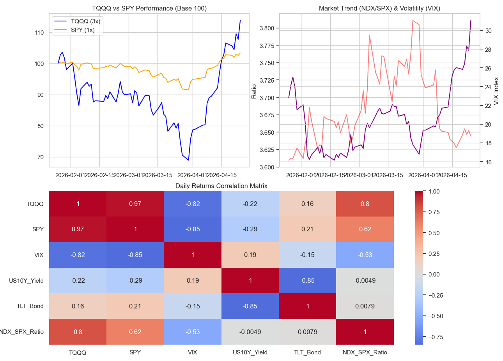

# TQQQ vs S&P500: レバレッジETFの統計的有意性とリスク検証

## 📌 プロジェクト概要
少額資産からの効率的な資産形成を目的とし、3倍レバレッジETF（TQQQ）の優位性をマクロ経済指標（米10年債利回り、VIX等）を用いて検証しました。直近の市場データに対し、単なるリターン比較ではなく、**対応のあるt検定**および**リスク調整後リターン（シャープレシオ）**の観点から統計的な評価を行っています。

## 📊 探索的データ分析 (EDA) と可視化

*(※ここに画像が表示されます)*

ヒートマップによる相関分析から、以下の事実が確認されました。
* **VIXとの強い負の相関**: TQQQとVIXには極めて強い逆相関があり、ボラティリティの上昇が直接的なドローダウンに直結する。
* **金利との関係**: 米10年債利回り上昇局面において、ハイテク・グロース株にレバレッジをかけたTQQQは強い下押し圧力を受ける。

## 🧮 統計的検証と数理的考察

日次リターンに対して対応のあるt検定（Paired t-test）を実施し、TQQQとSPY（S&P500）のパフォーマンスの差異が統計的に有意であるかを検証しました。

### 1. 統計的有意性の欠如
* **t値**: 0.6117
* **p値**: 0.5430
帰無仮説（両者の平均リターンに差はない）を棄却できず、TQQQの表面的な高リターンは、高いボラティリティ（分散）の範疇に収まる偶然のブレ（ノイズ）である可能性が高いことが示されました。

### 2. ボラティリティ・ドラッグの数理的影響
投資効率を測るシャープレシオにおいて、TQQQはSPYを下回りました。
$$\text{Sharpe Ratio}=\frac{R_p-R_f}{\sigma_p}$$
レバレッジ係数を $L$ とした際、幾何ブラウン運動における期待対数リターンは以下のように近似されます。
$$E[r]=\mu L-\frac{1}{2}\sigma^2 L^2$$
この分散項 $\sigma^2 L^2$（ボラティリティ・ドラッグ）がレバレッジ3倍（$L=3$）によって9倍に増幅されるため、横ばい相場や下落局面において急激な減価を引き起こしていることが、最大下落率（約33%）のデータからも裏付けられました。

## 💡 結論
データ分析および統計学的検証に基づくと、TQQQのアウトパフォームは特定の強い上昇トレンドに依存しており、一貫した優位性は認められませんでした。リスク管理と長期的な複利効果の最大化を企図するデータサイエンティストの視点では、ドローダウンが限定的でシャープレシオに優れる1倍インデックス（SPY）による運用が数理的に合理的であると結論付けます。

## 🚀 今後の課題と展望 (Future Work)

本検証では、単一のマクロ指標（VIXや米10年債利回り）との相関およびt検定による二群比較に留まりましたが、実際の市場メカニズムには複数の要因が複雑に絡み合っています。
モデルの精緻化とさらなるリスク要因の特定に向けて、今後は以下の分析アプローチを実装する予定です。

1. **因子分析（Factor Analysis）の導入**
   TQQQの超過リターン（あるいは大きなドローダウン）を構成する背後の「潜在変数」を特定するため、因子分析を用いた多変量解析アプローチを取り入れます。ファーマ・フレンチのマルチファクターモデル等も参考にし、市場のどの要素（グロース要因、モメンタム要因など）が最もリスクを増幅させているかを数理的に切り分けます。

2. **レジーム・スイッチングモデルの検討**
   「平時」と「ショック時」で市場のボラティリティの質が変わることを考慮し、隠れマルコフモデル（HMM）などを利用した相場環境（レジーム）の判定アルゴリズムを構築し、動的なリスク回避戦略の有効性を検証します。